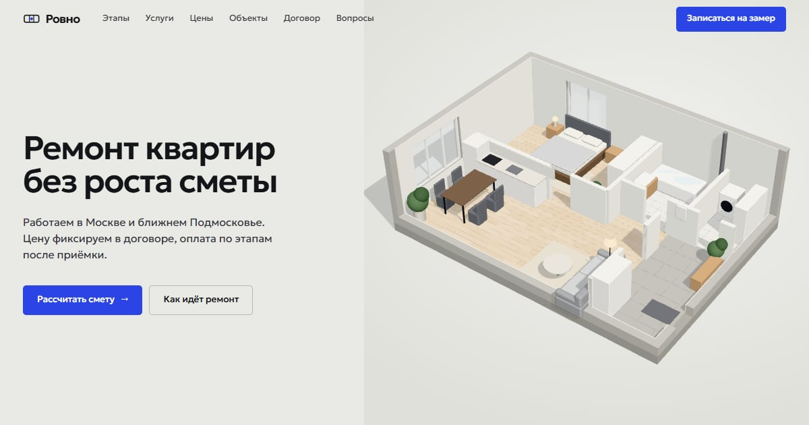

# Ровно — лендинг ремонта квартир

Сайт ремонтной компании, который продаёт главным для заказчика ремонта: смета фиксируется в
договоре, оплата по этапам после приёмки, фотоотчёт каждый день. Этапы ремонта собраны в
3D-сцену, которая раскрывается при прокрутке.

**Живое демо → https://automatorr192-dev.github.io/rovno/**



## Что внутри

- 3D-сцена этапов ремонта на Three.js, подгружается отдельно и не тормозит первый экран.
- Калькулятор: площадь, новостройка или вторичка, уровень отделки, дизайн-проект. Считает
  цену, срок в неделях и бюджет на материалы, результат уходит в форму заявки.
- Форма заявки с согласием на обработку данных, страницы политики и согласия.
- SEO: title и description под запрос «ремонт квартир под ключ в Москве», Open Graph,
  разметка JSON-LD (компания и FAQ), sitemap и robots.

## Сейчас это демо

Компания вымышленная. Форма проверяет поля и показывает подтверждение, но заявку никуда не
отправляет. Следующий шаг — заявки в AI-CRM и ИИ-смета по свободному описанию ремонта.

## Стек

HTML · CSS · JavaScript без фреймворка · Three.js (сборка esbuild) · GitHub Pages

## Сборка 3D-сцены

```bash
npm install
npm run build     # src/scene.js → assets/scene.js
```

Остальной сайт — статика, открывается из папки без сборки.
